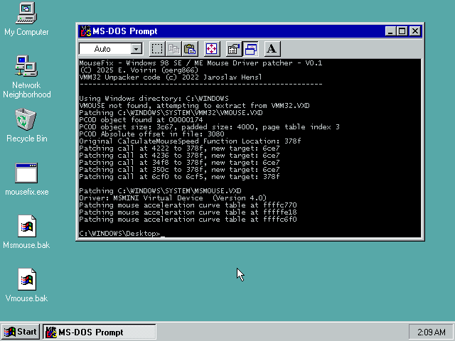

# win98-mousefix

Windows 98 SE / ME Mouse Driver Patch to remove DOS speed bugs and mouse acceleration

***Note: This patch is for Windows 98 Second Edition and Windows Millenium Edition. It MAY work on Windows 98 Gold or even Windows 95, but this has not been tested.***

## How to run the patch

The patch is a 32-bit windows application that runs on anything from 95 to 11.

There are 3 ways to run the patch:

* On the target system running Windows 98SE/ME, simply run it via `mousefix` or double clicking it

    Note: `VMOUSE.VXD` is part of `VMM32.VXD`. If is not found it will be extracted.

* You can run it by specifying a windows system directory anywhere to patch the files therein

    Example: `mousefix F:\Temp\Windows`

* You can also give it two filenames to `VMOUSE.VXD` and `MSMOUSE.VXD` respectively:

    Example: `mousefix F:\test\vmouse.vxd F:\test\msmouse.vxd`

## VMM32 VxD extraction code

This code was taken with gratitude from the fantastic ***patcher9x*** project by **Jaroslav Hensl (JHRobotics)**.

Check it out here: https://github.com/JHRobotics/patcher9x

## Download

Check **Releases** on this page (usually somewhere to the right).

## Building

In a standard OpenWatcom 2.x environment, type `wmake` and a `mousefix.exe` should magically appear.

## Future plans

* Add option to force PS/2 rate to 200Hz. The padding in PCOD is not enough to allow for this in Windows ME though :(
* Add some kind of GUI app to configure all this stuff
* Nuke acceleration from all speed options in the control panel (hard to do because that stuff is in user.exe)

# Reverse engineering notes

Reverse engineered by E. Voirin (oerg866)

## Speed values

* Default DOS mouse speed values reside at offset 
	* 0x7170 in unpacked VMOUSE.VXD from VMM32 (Windows 98 SE)
		* Default 0x32 X / 0x32 Y
	* 0x6160 in unpacked VMOUSE.VXD from VMM32 (Windows ME)
		* Default 0x32 X / 0x32 Y

## Mouse acceleration 

In `MSMOUSE.VXD`, profile settings are 32 bytes each with 3 tables:

* 0x3890 (98SE) / 0x3090 (ME), replace all 4 profiles with:
	* `01 7F 7F 7F 7F 7F 7F 7F 7F 7F 7F 7F 7F 7F 7F 7F 7F 7F 7F 7F 7F 7F 7F 7F 7F 7F 7F 7F 7F 7F 7F 7F`
* 0x3910 (98SE) / 0x3110 (ME), replace all 4 profiles with:
	* `10 7F 7F 7F 7F 7F 7F 7F 7F 7F 7F 7F 7F 7F 7F 7F 7F 7F 7F 7F 7F 7F 7F 7F 7F 7F 7F 7F 7F 7F 7F 7F`
* 0x3B18 (98SE) / 0x3318 (ME), replace all 4 profiles with:
	* `01 7F 7F 7F 7F 7F 7F 7F 7F 7F 7F 7F 7F 7F 7F 7F 7F 7F 7F 7F 7F 7F 7F 7F 7F 7F 7F 7F 7F 7F 7F 7F`

## DOS mouse speed fix

The mouse in DOS is very slow compared to Windows in this configuration.

The way the mouse gets initialized is that the SYS_VM_INIT control procedure in the VMOUSE VxD is called, which initializes a chunk of data for the virtual mouse device. This happens when the system VM starts (which is windows and all 16/32-bit applications therein) as well as every DOS VM (DOS window).

It uses the same base value from 0 to 100 to calculate the motion values for both, however in DOS this value appears to translate to a much slower visual speed.

The patch basically follows this principle:

1. Find size of PCOD object size
2. Change size to ~32 bytes more
3. add code to end of PCOD object (it has lots of padding in Win98SE, not so much in WinME but still enough to fit this)

	1. Check if the init is the SYSTEM VM
	2. If not, double the base values
    3. Call the original motion value calculation code

4. change call during VM_INIT control procedure to this function
5. change call during Int 33h Function 1A (set mouse sensitivity) handler to this function

# License

CC-BY-NC-SA 4.0

